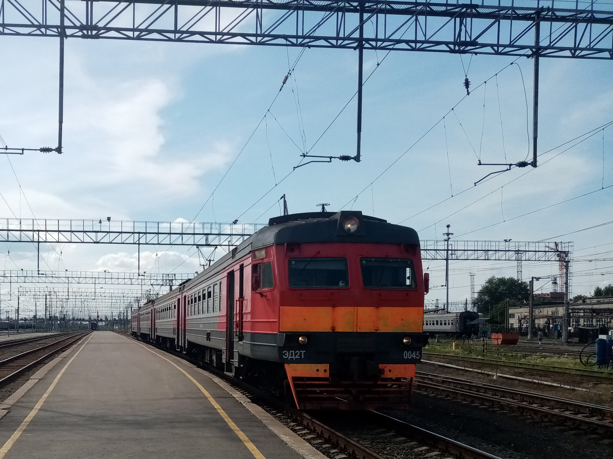

# Railway Depot Simulator



> **Предварительный проект / авторское видение**
>
> Этот документ описывает текущее видение проекта и не является окончательной спецификацией игры. Отдельные механики, структуры, термины и технические решения могут быть изменены, переработаны, дополнены или исключены в процессе дальнейшего проектирования и разработки.

---

## О проекте

**Railway Depot Simulator** — концепция глубокого симулятора железнодорожного депо и жизненного цикла моторвагонного подвижного состава.

Игрок управляет не отдельным поездом на маршруте, а целым техническим предприятием.

Основная модель строится по принципу:

**Состав → Вагон → Категория → Модуль → Агрегат → Конкретная деталь**

Каждый значимый технический объект может иметь собственное:

* техническое состояние;
* пробег или накопленную наработку, если это применимо к объекту;
* возраст;
* историю ремонтов;
* неисправности;
* установленные компоненты;
* жизненный цикл.

---

## Что делает игрок?

Игрок управляет железнодорожным депо и принимает решения, связанные с эксплуатацией и обслуживанием подвижного состава.

В зависимости от уровня сложности игрок может:

* анализировать состояние поездов;
* проводить диагностику;
* отправлять составы на техническое обслуживание и ремонт;
* выполнять ремонт вручную;
* выбирать конкретные запасные агрегаты и компоненты;
* формировать и переформировывать составы;
* использовать старые вагоны и технику как источники запчастей;
* управлять складом;
* отправлять вагоны и составы в другие депо;
* развивать инфраструктуру;
* выполнять задания перевозчика;
* определять готовность состава к эксплуатации.

---

## Состав — это не просто один объект

Каждый состав состоит из отдельных вагонов.

Вагоны, в свою очередь, содержат технические объекты, системы, модули, агрегаты и компоненты.

Например:

```text
ЭР2Т-7163
└── Вагон 02
    └── Электрика
        └── Контакторно-реостатная система
            └── Блок реостатов
                └── Конкретный реостат
```

При этом конкретный технический объект может иметь собственную историю:

```text
Производство
↓
Установка на вагон
↓
Ремонт
↓
Демонтаж
↓
Хранение
↓
Установка на другой вагон
↓
Текущая эксплуатация
```

История существует не только у состава, но и у отдельных вагонов и технических объектов.

---

## Техническое состояние

Состояние объекта не сводится к одной полоске здоровья.

Оно представляет собой агрегированную характеристику, на которую могут влиять:

* возраст;
* пробег или накопленная наработка;
* количество ремонтов;
* предыдущие дефекты;
* качество ремонта;
* установленные компоненты;
* накопленный износ;
* другие характеристики объекта.

Неисправности должны иметь причины и последствия.

Например:

```text
Износ
↓
Дефект
↓
Повышенная вероятность отказа
↓
Отказ на линии
↓
Задержка
↓
Штраф / последствия для перевозчика
↓
Финансовые последствия
```

При этом состояние объекта не определяет исход однозначно: оно влияет на вероятности возникновения и развития проблем.

Цель системы — сделать последствия решений игрока причинно связанными, а не полностью случайными.

---

## Депо — физический объект

Депо является частью игрового мира, а не просто экраном меню.

На его территории находятся:

* пути отстоя;
* ремонтные пути;
* мастерские;
* тупики;
* склад;
* малярные участки;
* пути отправления;
* места хранения списанных и донорских вагонов.

Составы и вагоны физически перемещаются по территории депо.

Если все подходящие пути заняты, игрок должен учитывать это при планировании работы.

При этом объекты, находящиеся за пределами территории депо, продолжают существовать в симуляции даже без постоянного физического отображения в 3D.

---

## Ремонт

Предусмотрены два основных подхода.

### Регламентированный ремонт

Игрок отправляет состав или технический объект на определённую процедуру обслуживания или ремонта.

Система выполняет предусмотренный набор операций автоматически или с минимальным участием игрока.

### Ручной ремонт

На более высокой сложности игрок самостоятельно определяет:

* что диагностировать;
* что ремонтировать;
* какой компонент заменить;
* какой агрегат установить;
* откуда взять запчасть;
* использовать ли компонент от другого состава;
* насколько глубоко разбирать объект.

Игрок может принимать неправильные технические решения.

Игра должна реагировать на них последствиями, а не постоянно запрещать действия.

---

## Формирование составов

Игрок может менять текущую физическую составность поездов и отдельных вагонов.

Можно:

* заменять вагоны;
* передавать вагоны между составами;
* переформировывать составы;
* использовать вагоны разных исходных составов;
* создавать составы из вагонов, имеющих различное происхождение.

При этом каждый вагон сохраняет собственную идентичность и историю независимо от того, в составе какого поезда он находится в данный момент.

Исходная заводская составность сохраняется как часть исторической информации об объекте.

---

## Живой мир

Другие депо и предприятия существуют независимо от игрока.

Они могут:

* ремонтировать поезда;
* получать и передавать вагоны;
* списывать подвижной состав;
* выполнять различные виды ремонта;
* модернизировать технику;
* отправлять и получать компоненты;
* менять собственный парк и его техническое состояние.

Междеповские операции являются частью симуляции мира, а не только абстрактными таймерами.

---

## История

История является одной из центральных систем проекта.

Для значимых объектов могут существовать события:

* производство;
* установка;
* демонтаж;
* ремонт;
* модернизация;
* перевод;
* переформирование;
* появление дефекта;
* эксплуатация;
* хранение;
* списание;
* утилизация.

В результате конкретный состав, вагон или технический объект может иметь собственную уникальную биографию, сформированную событиями симуляции и действиями игрока.

---

## Историческая основа

Первая версия проекта ориентирована на постсоветскую железнодорожную систему.

Реальные данные используются прежде всего для формирования **исходной идентичности объектов**.

В качестве исходных данных могут использоваться:

* серия;
* заводской тип;
* факт существования конкретного состава;
* факт существования конкретного вагона;
* производитель;
* год производства;
* исходная заводская составность;
* особенности конкретного состава на момент выхода с завода.

Производитель также определяет место производства.

При этом реальные данные не задают дальнейшую судьбу объекта.

После начала новой игры дальнейшая история формируется симуляцией и может отличаться от реальной:

* составы могут менять депо;
* вагоны могут передаваться между составами;
* техника может ремонтироваться и модернизироваться;
* составы могут переформировываться;
* возникают дефекты и отказы;
* меняется техническое состояние;
* объекты могут быть списаны или утилизированы.

Таким образом, реальные данные определяют **происхождение и заводскую основу объекта**, а дальнейшая история создаётся непосредственно игрой.

---

## Первая версия

Основной принцип первой версии:

> **Одна серия, но максимально глубокая симуляция.**

В качестве первой серии рассматривается **ЭР2Т**.

Вместо большого количества поверхностно смоделированных поездов приоритетом является глубокая проработка одной серии и архитектуры, позволяющей добавлять другие серии в будущем.

Первая версия должна охватывать:

* составы и их переформирова*
